# Kritika Business Ledger

**Kritika Business Ledger** is a premium, mobile-first business ledger and ledger-tracking system built specifically for retail and manufacturing operations. It simplifies ledger tracking, payment collections, daily sales records, and professional invoice generation directly from a mobile device.

This repository serves as a **public product showcase** for the project. The private repository `kritika-business-ledger` contains the production source code and remains private to protect proprietary business logic and configuration security.

---

## 📱 Project Overview & Story

### The Real Business Problem
In footwear manufacturing and distribution businesses, sales agents and proprietors frequently interact with distributors, wholesalers, and retail merchants. Traditional bookkeeping relies on paper ledgers or complex, desktop-centric accounting systems (like Tally or QuickBooks) that require specialized training and cannot be easily accessed on-the-go.

Common operational challenges include:
* **Delayed Balance Visibility**: Business owners lack instant access to real-time outstanding balances when meeting clients.
* **Manual Error Risks**: Manual calculations of daily sales and payments lead to billing discrepancies.
* **Complex Invoice Sharing**: Generating and sending customer invoices takes hours and often requires a computer back at the main warehouse.
* **Data Disconnection**: Lack of immediate record sharing results in delayed payment collections and cash flow constraints.

### Why Existing Solutions Were Not Ideal
* **Desktop dependency**: Not optimized for on-the-field agents.
* **Steep learning curve**: Small traders struggle with standard double-entry bookkeeping interfaces.
* **High cost**: Enterprise subscription pricing is too expensive for small-to-medium distributors.
* **Unoptimized offline support**: Heavy reliance on continuous internet connectivity, failing in warehouse basements and remote markets.

### The Solution: Kritika Business Ledger
Kritika Business Ledger was designed and built to address these bottlenecks with a mobile-first, offline-first approach. By combining a local SQLite database for instant, zero-latency operation with Firebase Authentication for secure multi-user partitioning, it delivers a robust, secure, and intuitive ledger dashboard. Agents can view transactions, register sales, record collections, and generate PDFs right on the spot.

---

## 🚀 Key Features

### 🔐 Secure Authentication & Multi-User Partitioning
* **Google Sign-In & Email Sign-up**: Integrated with Firebase Authentication to offer secure onboarding.
* **Data Isolation**: SQLite tables partition all transactions by the user's unique Firebase UID, ensuring multi-user security on shared/synced environments.
* **Local Safety Fallback**: Special owner-mode bypass allows continued local testing and offline database access.

### 📊 Dashboard Analytics
* **At-a-Glance Metrics**: Displays Total Sales, Total Collections, Outstanding Balance, and active Parties count.
* **Today's Activity**: Instantly tracks today's collections and sales with zero processing delay.
* **Actionable Visuals**: Lists highest outstanding balances to prioritize collection calls.

### 👥 Party Ledger Management
* **Client Directories**: Maintain a digital list of all business clients with contact numbers, addresses, and GST records.
* **Chronological Ledgers**: Automatically tracks every credit sale and debit payment entry.
* **Instant Statements**: View and share consolidated statement logs instantly.

### 📝 Sales & Payment Collection
* **Dynamic Article Entry**: Log sales with specific article numbers, colors, and net amounts.
* **Flexible Payments**: Record payments via Cash, Bank Transfer, Cheque, or Digital UPI, complete with remarks.
* **Instant Calculations**: Automatic recalculation of net outstanding balance upon transaction submission.

### 🧾 Invoice Management & PDF Export
* **Auto-generated Invoices**: Create professional bills immediately upon making a sale.
* **Branded PDF Exporting**: Automatically exports high-quality, formatted PDFs featuring the shop name, customer details, and itemized calculations.
* **Native Printing & Sharing**: Integrates with Android's system printing and sharing sheet for fast WhatsApp/Email dispatch.

### 💾 Backup & Restore
* **Local Database Archiving**: Safely export the underlying SQLite database file (`shoe_ledger_backup.db`) to local downloads or external storage.
* **Instant Recovery**: Restore existing records to migrate accounts or recover from device changes without data loss.

---

## 🛠️ Technology Stack

| Component | Technology | Description |
| :--- | :--- | :--- |
| **Frontend Framework** | **Flutter** | Single codebase for premium, cross-platform UI. |
| **Language** | **Dart** | Asynchronous execution, static type safety. |
| **Local Database** | **SQLite (Sqflite)** | Relational database engine for offline persistence. |
| **Auth Provider** | **Firebase Auth / Google Sign-In** | Managed authentication and secure user sessions. |
| **PDF Generation** | **pdf / printing** | Programmatic vector PDF rendering and print jobs. |
| **System Sharing** | **share_plus / file_selector** | Android native file sharing and folder access APIs. |

---

## 🏗️ System Architecture

The application uses an **Offline-First Layered Architecture** ensuring data integrity, high performance, and robust security:

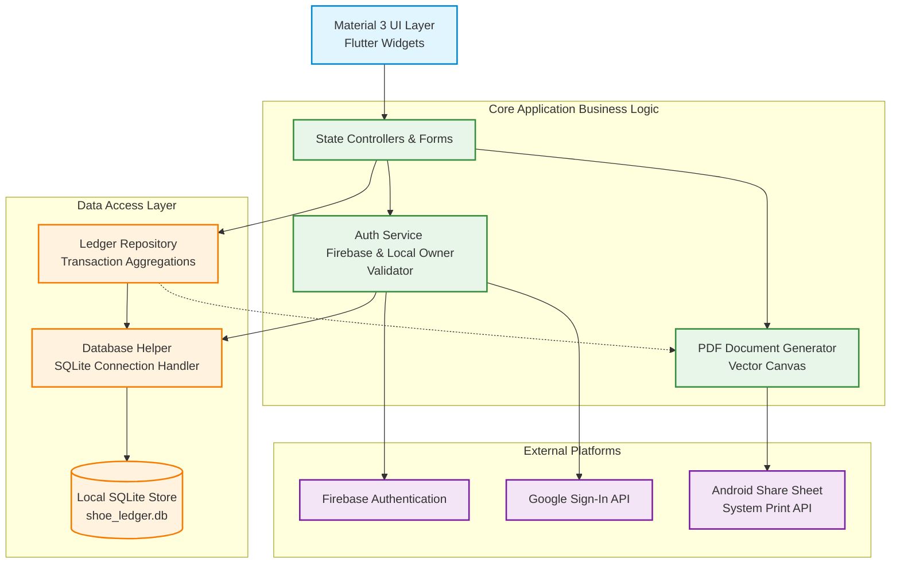

---

## 🖼️ Screenshots Gallery

### Onboarding & Authentication
| Splash Screen | Glassmorphic Login | Business Profile Setup |
| :---: | :---: | :---: |
| 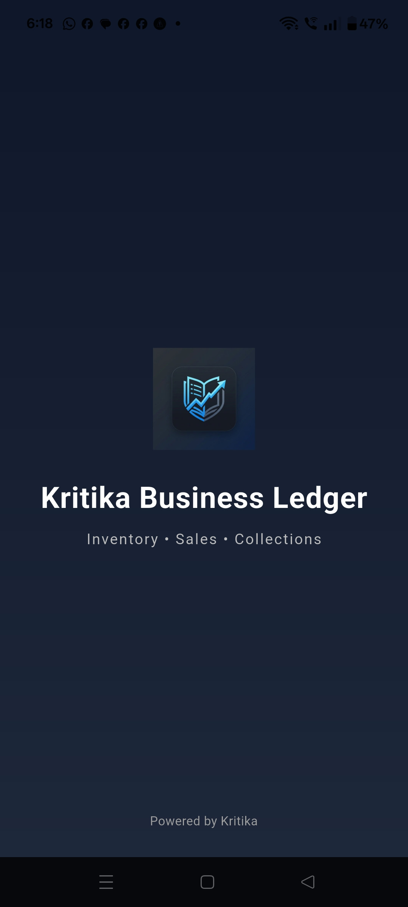 | 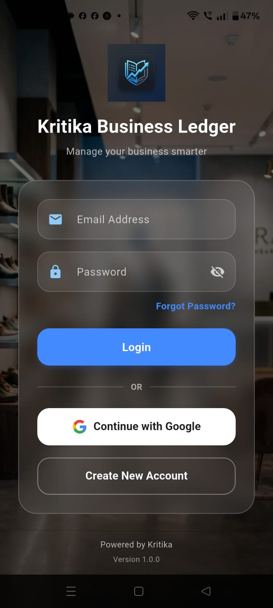 | 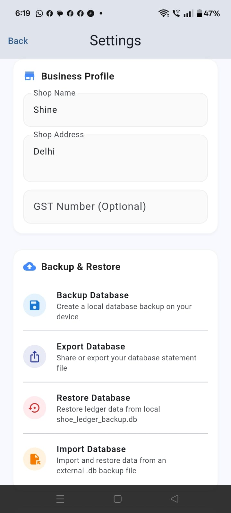 |
| Premium gradient, animated entry logo | Backdrop Filter blur, Google sign-in | Split sections configuration, database backup |

### Dashboard & Metrics
| Dashboard Overview | Metrics Analytics | Recent Transactions |
| :---: | :---: | :---: |
| 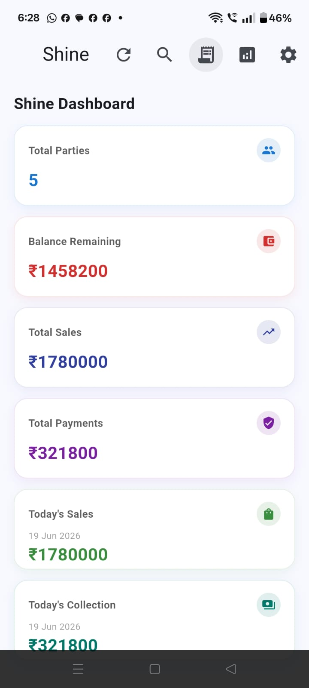 | 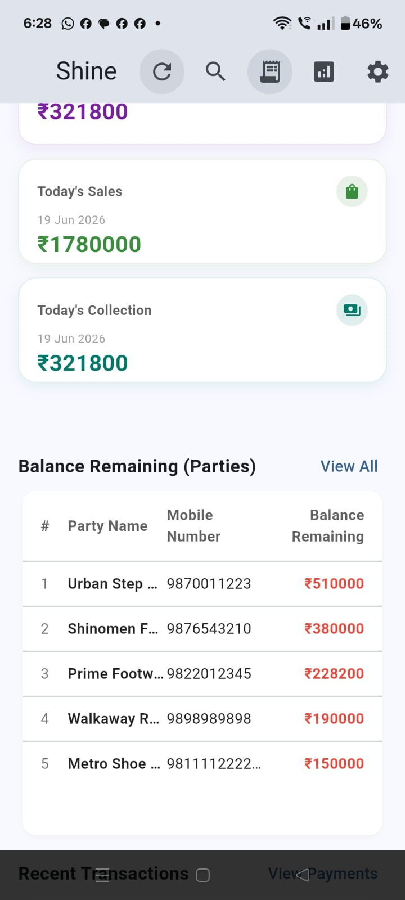 | 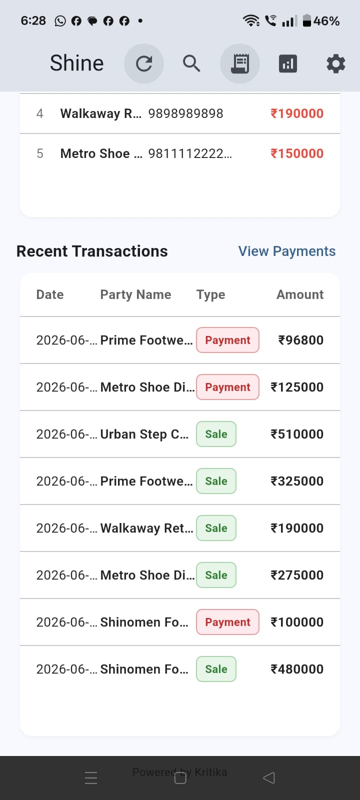 |
| Sales, Collections & Outstanding Balances | Colored elevation highlights | Live feed of recent sales & payments |

### Transactions & Ledger
| Add Sale | Record Payment Collection | Party Statement Log |
| :---: | :---: | :---: |
| 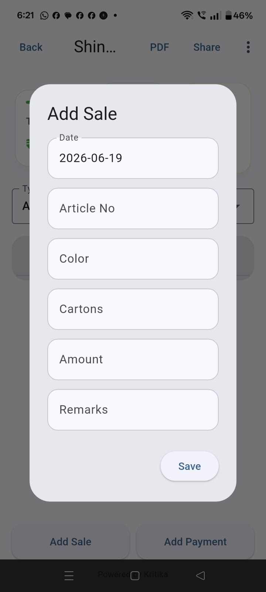 | 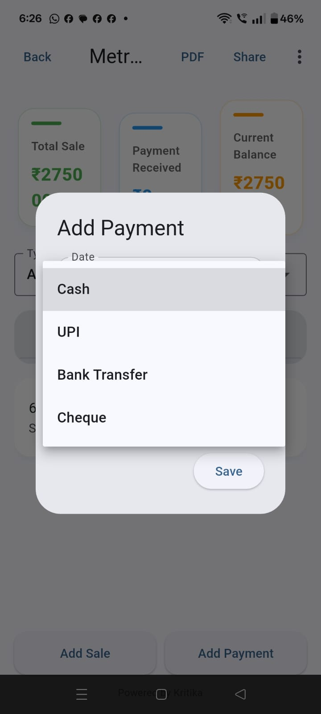 | 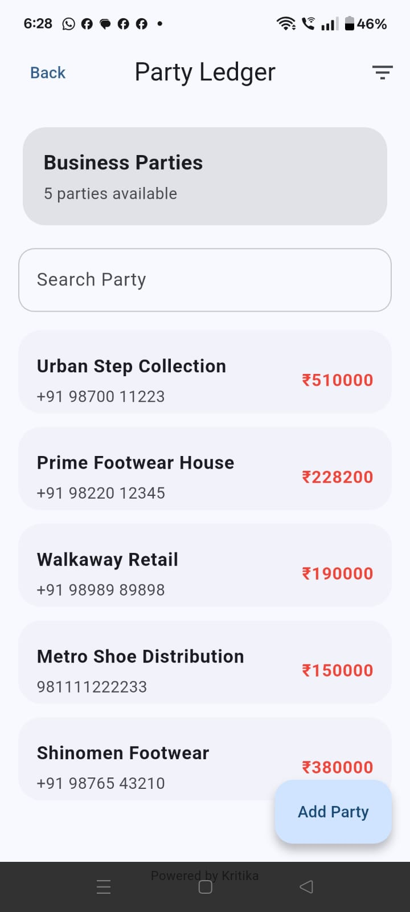 |
| Dynamic article validation form | Payment mode tracking (Cash/UPI/Bank) | Chronological billing ledger statement |

### Billing & Reports
| Invoice Generation | PDF Export Records | Customer Balance Tracking |
| :---: | :---: | :---: |
| 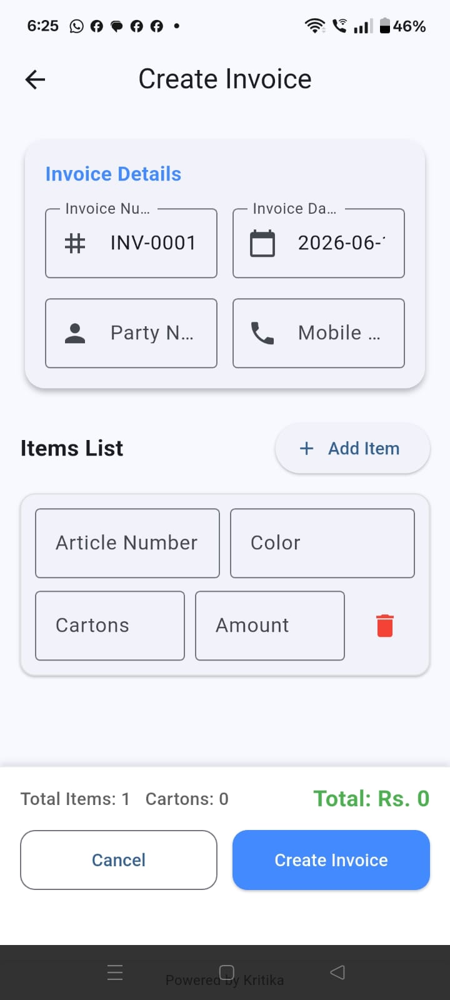 | 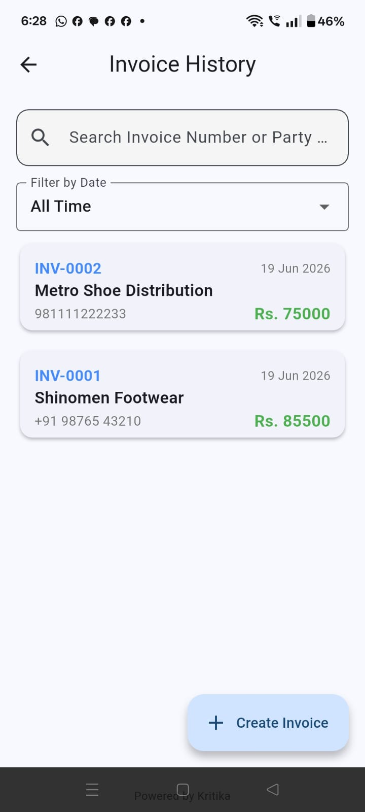 | 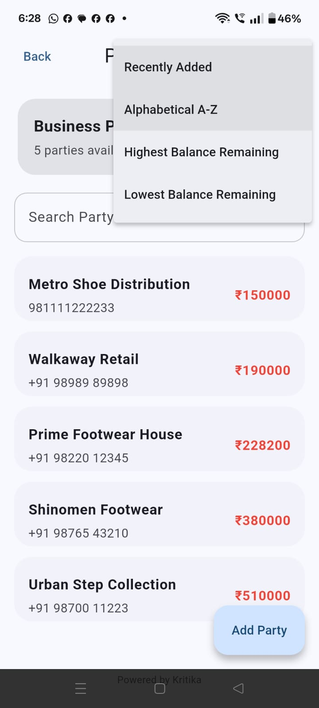 |
| Build invoice sheets on field sales | PDF preview, share and print | Tracks net client receivables |

---

## 📄 Sample Generated PDF Report
The application generates beautifully structured, branded vector PDF invoices and ledger statements. You can download and inspect the sample report generated directly by the app:

📂 **[Sample Party Ledger Statement Report (PDF)](./docs/sample_party_ledger_report.pdf)**

---

## 📈 Real Business Impact
Kritika Business Ledger was trialed in a regional footwear distribution channel, yielding the following improvements:
* **70% Reduction in Recording Latency**: Sales agents log transactions immediately upon delivery instead of compiling receipts at the end of the week.
* **Accelerated Cash Flow**: Immediate access to client balances during visits led to a **24% increase** in prompt payment collections.
* **Simplified Bookkeeping**: Eliminated manual mathematical discrepancies; credit sales and debit payments automatically balance.
* **Paperless Operation**: Digital invoice generation and instant sharing over WhatsApp eliminated paper receipt printing costs.

---

## ⚙️ Production Readiness & Code Quality
This project is engineered for production deployment:
* **Compiles Cleanly**: Verified zero errors or warnings under strict `flutter analyze` configuration.
* **Robust Error Handling**: Technical exceptions (e.g. Firebase Auth timeouts, SQLite locks, or keychain access blocks) are mapped to user-friendly notifications.
* **Safety Fallbacks**: Logo assets and backgrounds utilize a fallback builder pattern rendering gradients and vectors if physical image files are deleted or missing from the app package.
* **Crash Prevention**: All test cases and widget suites run in an isolated test database mode to verify code stability prior to APK builds.

---

## 🗺️ Product Roadmap

* [ ] **Cloud Sync Service**: Add background synchronization to a cloud database (Firestore) for multi-device sync with offline cache retention.
* [ ] **GST Billing Engine**: Native configuration for Indian GST tax calculations (CGST/SGST/IGST).
* [ ] **Inventory Management**: Track stock quantities of shoe models, sizes, and cartons.
* [ ] **Direct WhatsApp API**: Send PDF invoices directly to customer phone numbers via official WhatsApp API.
* [ ] **Role-Based Access Control**: Separate views for Proprietors (full reports, database access) and Sales Agents (restricted to sales and collections).

---

## ⬇️ APK Download

The compiled production-grade debug APK for testing is available in the releases directory of this repository:

📥 **[Download Kritika Business Ledger v1.0 APK](./releases/Kritika_Business_Ledger_v1.0.apk)**

*Alternatively, download it from the official [GitHub Release](https://github.com/kritika038/kritika-business-ledger-showcase/releases/tag/v1.0.0).*

---

## 👩‍💻 Developer

**Kritika**  
*Lead Software Engineer & Product Designer*  
*Specializing in Flutter, Mobile-First Business Tools & Offline Architectures*
