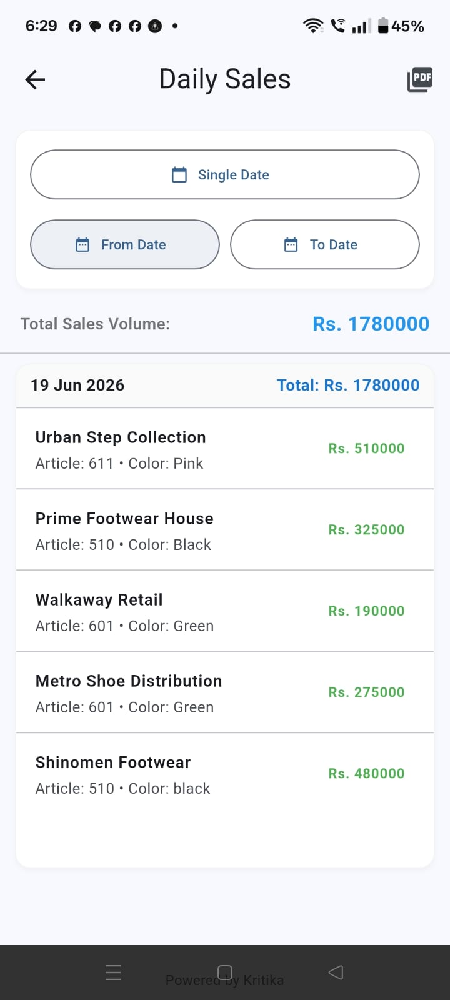

# Kritika Business Ledger

[](https://github.com/kritika038/kritika-business-ledger-showcase)
[](https://github.com/kritika038/kritika-business-ledger-showcase)
[](https://github.com/kritika038/kritika-business-ledger-showcase)
[](https://github.com/kritika038/kritika-business-ledger-showcase)
[](https://github.com/kritika038/kritika-business-ledger-showcase)
[](https://github.com/kritika038/kritika-business-ledger-showcase)

**Kritika Business Ledger** is a premium, mobile-first business bookkeeping and customer outstanding balance tracker designed specifically for manufacturing, distribution, and wholesale trade. It simplifies daily ledger management, payment collections, credit sales tracking, and itemized invoice generation.

This is the **public showcase repository** featuring app documentation, assets, and compiled executables. The private repository `kritika-business-ledger-` houses the source code.

---

## 📖 The Project Story
Kritika Business Ledger was developed to solve a real-world business challenge in a footwear manufacturing and distribution enterprise. 

The business owner primarily operated through a mobile device and needed a simpler, faster alternative to complex accounting software (like Tally or QuickBooks) for:
* Customer balance tracking
* Daily sales recording
* Payment collection tracking
* Invoice generation
* PDF statement export
* Business reporting

Existing corporate accounting software was desktop-centric, expensive, and required formal accounting training. Kritika Business Ledger was designed as a mobile-first solution focused on **speed, simplicity, and offline usability**, allowing agents and proprietors to update billing records instantly on-the-field.

---

## 🚀 Key Features

* **Firebase Authentication & Google Sign-In**: Secure user accounts with verified credentials and seamless sign-in.
* **Offline-First SQLite Database**: Absolute zero-latency offline performance, ensuring local data access in warehouses or remote merchant routes.
* **Customer Ledger Management**: Maintained records of credit sales, collections, and transactions mapped dynamically by party.
* **Daily Sales & Collection Tracking**: Real-time logging of credit transactions and payments.
* **Outstanding Balance Monitoring**: Highlights receivables on the dashboard, making collections easier.
* **On-the-Spot Invoice Generation**: Quick billing workflows with automated itemized subtotals.
* **PDF Export & Native Sharing**: Streamlined vector PDF rendering for statements and invoices, ready to print or share via WhatsApp/Email.
* **Backup & Restore**: Easily archive the underlying database file (`shoe_ledger_backup.db`) and recover the session on new hardware.
* **Business Dashboard Analytics**: Colored visual indicators showing net sales, collections, and total outstanding debt.
* **Search & Filters**: Comprehensive filters to search transactions by keyword, date ranges, or payment modes.
* **Mobile-First UI**: Modern Material 3 dashboard layout engineered for high readability on small viewports.

---

## 🛠️ Tech Stack

* **Frontend**: Flutter, Dart
* **Backend Services**: Firebase Authentication, Google Sign-in API
* **Database**: SQLite (Sqflite)
* **Reporting**: Programmatic PDF Generation (`pdf`, `printing` packages)
* **Platform**: Android
* **Version Control**: Git, GitHub

---

## 🏗️ Architecture Flow

The transactional architecture flows sequentially as follows:

```
User Authentication
         ↓
     Dashboard
         ↓
Party Ledger Management
         ↓
   Sales Tracking
         ↓
 Payment Collection
         ↓
 Invoice Generation
         ↓
     PDF Export
         ↓
  Backup & Restore
```

---

## 🎯 Recruiter & Technical Portfolio Highlights

For hiring managers, placement committees, and recruiters, this project demonstrates:

* **Real-World Business Impact**: Built to address cash flow latency in wholesale distribution, delivering a solution that was actively field-tested.
* **Mobile-First Design**: Optimized for single-hand viewport usage, replacing desktop dependencies with fluid mobile flows.
* **Offline-First Architecture**: Implemented local SQLite persistence with relational integrity, cascading deletes, and unique indexing, enabling complete offline operational capacity.
* **Secure Enterprise Authentication**: Integrated Firebase Auth with verification flows, ensuring secure data isolation between distinct client profiles.
* **Robust PDF Layout Engine**: Used custom vector canvases (`pdf/widgets.dart`) for professional formatted exports, avoiding low-fidelity HTML-to-image wrappers.
* **Production Build Quality**: Achieved a 100% warning-free compilation output under strict `flutter analyze` linter rules, verified by an active widget smoke-testing suite.

---

## 📥 Android APK Download

The compiled production-ready debug APK is available for download:

👉 **[Download Kritika Business Ledger v1.0 APK](./releases/Kritika_Business_Ledger_v1.0.apk)**

*You can also find this asset attached directly to the official [GitHub Release](https://github.com/kritika038/kritika-business-ledger-showcase/releases/tag/v1.0.0).*

---

## 📄 Sample Report Export
An example of the PDF statement generated natively by the application can be downloaded here:

📂 **[Sample Party Ledger Statement Report (PDF)](./docs/sample_party_ledger_report.pdf)**

---

## 🖼️ Screenshots User Flow

### 1. Launch & Authentication
| 01. Splash Screen | 02. Login Screen |
| :---: | :---: |
|  |  |
| Slate dark gradient with elegant fade-in entrance transition. | Glassmorphic card overlay with secure email & Google authentication. |

### 2. Business Dashboard Analytics
| 03. Dashboard Overview | 04. Metrics Highlights | 05. Recent Transactions |
| :---: | :---: | :---: |
|  |  |  |
| General sales, collection, and outstanding summaries. | Colored indicators and responsive LayoutBuilder grids. | Real-time audit logs of recent credits and payments. |

### 3. Customer Directories & Sales Logs
| 06. Party Ledger Statement | 11. Add Credit Sale | 13. Customer Balance Tracking |
| :---: | :---: | :---: |
|  |  |  |
| Consolidated customer ledger records. | Log new credit transactions on the spot. | Tracks net client receivables instantly. |

### 4. Billing Operations & Collections
| 07. Invoice Creation | 08. Invoice History Log | 09. Daily Sales Report | 10. Payment Entry |
| :---: | :---: | :---: | :---: |
|  |  |  |  |
| Interactive billing workflow helper. | List of generated invoice sheets. | Aggregated reports with PDF print layout options. | Record collections via Cash, Bank, Cheque, or UPI. |

### 5. Utilities & Backups
| 12. Backup & Restore |
| :---: |
|  |
| Export or restore the local database file (`shoe_ledger_backup.db`) safely. |

---

## 📝 Release Notes - v1.0.0

### Production Release (Initial Launch)
* **Authentication Core**: Integrates Firebase Auth and Google Sign-in to deliver secure user sessions.
* **Relational Database Helper**: SQLite schema version `9` with localized data isolation and cascade rules.
* **SaaS Dashboard**: Displays outstanding balance highlights, net sales, and client counts.
* **Vector PDF Compiler**: Exports branded invoices and statements with print/share integrations.
* **Safety Assertions**: Gradients and vectors fall back gracefully if app asset packages are missing.
* **Exception Mapping**: Graceful validation prompts for authentication gaps, database operations, and platform limits.
